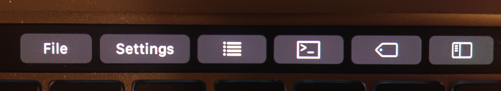
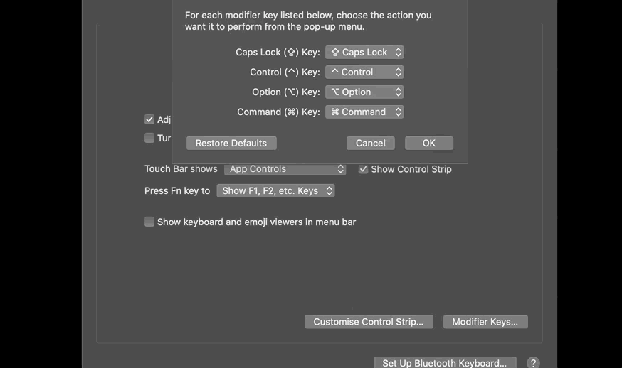
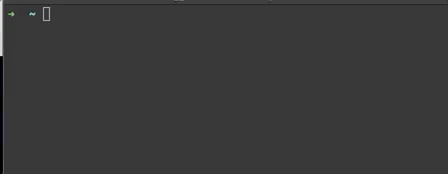

# Testaverde

More human vim

## Before we start

I'm a total noob in vim script so I use the simplest methods possible if you see
that something can be improved, just let me know.

## What's the point

Time passed, and i started to like VIM, but to have autocomplete you have to use
pyhton plugins which to be honest i do not like at all.

But this config/distro is different.

## Advices

Do not use esc, especially on touchbar macbooks, map esc to caps lock.
System preferences => keyboard => modifier keys (bottom right)

## Instalation

[Go to wiki](https://github.com/DesantBucie/Kinder-Vim/wiki)

## Uninstall

If you do not like this, and want to remove it, simply delete ~/.vimrc,
and ~.vim from your home directory.
You will also need to remove ~/.config/coc.

