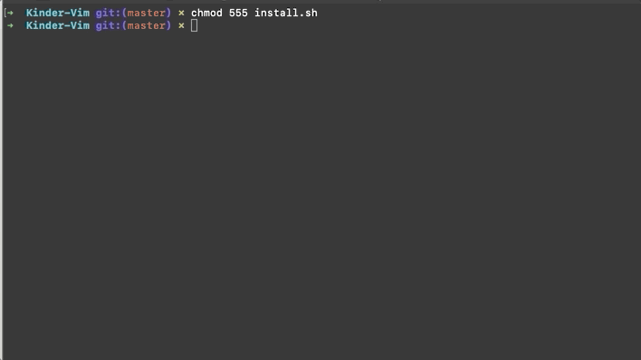

# Kinder-VIM

More human vim


## Before we start

I'm a total noob in vim script so I use the simplest methods possible if you see
that something can be improved, just let me know.

## What's the point

When i was introduced to VI(M),i quite did not like it. It was hard to edit
anything for me, keyboard arrows did not worked, when I'm so used to them.

Time passed, and i started to like VIM, but to have autocomplete you have to use
pyhton plugins which to be honest i do not like at all.

But this config/distro is different.

## What's inside

Vim-Plug for packages managment
[vim-plug](https://github.com/junegunn/vim-plug)

Autocompletion system is Coc, node based, very fast and easy to use. In fact
it's very similar to VSCode. [More here:](https://github.com/neoclide/coc.nvim)

It also has NERDTree (as Netrw was too unreliable, and Coc explorer is still in
heavy development)
[NERDTree](https://github.com/preservim/nerdtree)

Colorsheme is molocai ported to vim by tomasr
[Molocai](https://github.com/tomasr/molokai)

## Prerequisites

* nodejs > 10.12
* macvim 8.1 or newer(no support for linux or windows yet)

### Nix-shell,nvm or similar

If you use nixshell or nvm you will need to specify node's path in
coc-settings.json in this package

```javascript
    {
    "npm.binPath": "full/path/to/npm"
    //(for example /nix/store/52xbdvmcncf1hq4z6qdz321aimckjbgv-nodejs-14.9.0/bin/npm)
    }
```

and enter your path to node in this .vimrc(line 60):

```vim
"/full/path/to/node"
let g:coc_node_path = '/nix/store/52xbdvmcncf1hq4z6qdz321aimckjbgv-nodejs-14.9.0/bin/node'
```

If you use normaly installed nodejs package !DELETE! coc-settings from the package

## Advices

Do not use esc, especially on touchbar macbooks, map esc to caps lock.
System preferences => keyboard => modifier keys (bottom right)


## Instalation

### MAC

You may need to analyse what Coc packages do you need in package.json, as i did
not put all of them to
[install](https://github.com/neoclide/coc.nvim/wiki/Using-coc-extensions#install-extensions)
At the bottom of the page you will find all packges

Add them after space like i did i install.sh, or leave them as it is.
You can ALWAYS install them from vim, not the script.

Run install.sh, and everything should install by itself. If you encounter any
errors, report in issues.



## Post-Instalation

Now you can add any coc package just by command `:CocInstall pakage-name (i.e coc-html)`.


## Keybindings 

Ctrl-e - nerdtree
Ctrl-s - split
Tab - next window
Ctrl-t - new tab

## Uninstall

If you do not like this, and want to remove it, simply delete ~/.vimrc,
and ~.vim from your home directory.
You will also need to remove ~/.config/coc.


## TODO

Better touchbar integration
